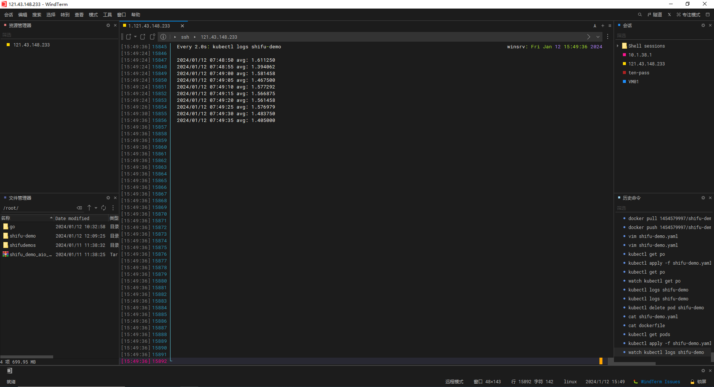

### shifu-demo

#### 使用步骤
1. 安装docker：https://docs.docker.com/desktop/install/linux-install/
2. 安装shifu
```bash
curl -sfL https://raw.githubusercontent.com/Edgenesis/shifu/main/test/scripts/shifu-demo-install.sh | sudo sh -
```
3. 下载程序代码
```bash
git clone https://github.com/p-mega/shifu-demo
```
4. 打包构建镜像
```bash
docker build -t shifu-demo .
```
5. 构建Pod并运行
```bash
kubectl apply -f shifu-demo.yaml
```
6. 查看运行效果

